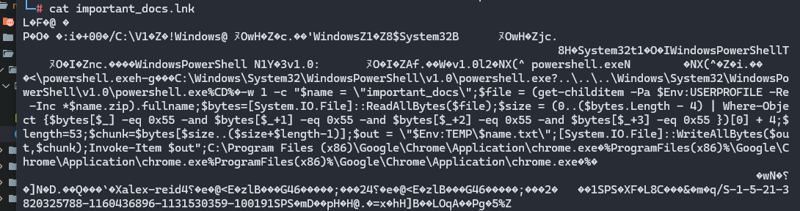

# CrackMe Challenge Writeup

**Category:** Reverse Engineering  
**CTF Name:** NahamCon CTF 2025  


---

## 🔍 Challenge Description

> Author: @Kkevsterrr

> Like American Gangster, but for other stuff.


---

## 📂 Files Provided  

- `deflationgangster.zip`

---


---

## 📝 Approach  

I was so confused, because on unziping we get `important_docs.lnk`
and i didn't knew wth is this :/




But i when i did strings deflationGangster.zip
it gave some thing meaningful in end

```

└─# strings deflationGangster.zip


important_docs/PK
Z.EOH
important_docs/important_docs.lnk
~R;u:5
ZF/&
b"Bw
.lD=~
 t$1
xYhH
PRzX
W.VE
`!&3
6<eEJ
Z<3u]
Z1WVW]w
u':h5E
'Pcrg
$)#|
OS8(
Ac<Q
5Lsu
_T/^V
%zgP
~j      =
HqGg
h\S{bi#
_H|>My
K]$q=
`NoI
u85pb
M{^x
;DEFGZmxhZ3thZjExNTBmMDdmOTAwODcyZTE2MmUyMzBkMGVmOGY5NH0K
important_docs/PK
Z.EOH
important_docs/important_docs.lnkPK

```

in the end it is some thing so i gave it so AI to decode it and it gave me a solve script lol

```

import base64

s = "ZmxhZ3thZjExNTBmMDdmOTAwODcyZTE2MmUyMzBkMGVmOGY5NH0K"
print(base64.b64decode(s))


```

---

## 🏁 Flag  

`flag{af1150f07f900872e162e230d0ef8f94}`

---

## 📌 Notes  

- Dont underestimate strings xD

