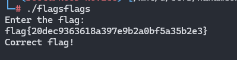

# FlagsFlagsFlags Challenge Writeup

**Category:** Reverse Engineering  
**CTF Name:** NahamCon CTF 2025  


---

## 🔍 Challenge Description  

> Author: @Kkevsterrr

>Did you see the strings? One of those is right, I can just feel it.
>Download the file(s) below.

---

## 📂 Files Provided  

- `flagsflags`


## 📝 Approach  

1. The binary could be indeed solved without bruteforcing. But i took the Description seriously xD

---


## 📝 Script
> This brute script is multi threaded
````

#!/usr/bin/env python3
import subprocess
import sys
import os
from multiprocessing import Process, Event, Queue, cpu_count

CANDIDATES_FILE = "candidates.txt"
BIN_PATH        = "./flagsflags"
BAD_MARKER      = "Incorrect flag!"

def worker(worker_id, flags_slice, offset, total, stop_evt, out_q):
    """
    worker_id: 0-based index of this worker
    flags_slice: list of flags this worker should test
    offset: how many flags came before this slice
    total: total number of flags
    stop_evt: Event to signal “stop now”
    out_q: Queue to report a winner
    """
    for i, flag in enumerate(flags_slice, start=1):
        if stop_evt.is_set():
            return

        global_idx = offset + i
        # log what we're testing
        print(f"[W{worker_id}] Testing [{global_idx}/{total}]: {flag}", flush=True)

        # run the binary
        proc = subprocess.run(
            [BIN_PATH],
            input=flag + "\n",
            stdout=subprocess.PIPE,
            stderr=subprocess.STDOUT,
            text=True,
        )
        output = proc.stdout

        # check for success
        if BAD_MARKER not in output:
            out_q.put((flag, output.strip()))
            stop_evt.set()
            return

def main():
    # Load flags
    with open(CANDIDATES_FILE) as f:
        flags = [line.strip() for line in f if line.strip()]
    total = len(flags)
    print(f"[*] Loaded {total} candidates.\n")

    # Prepare worker slices
    n_cores   = cpu_count()
    chunk_sz  = (total + n_cores - 1) // n_cores
    slices    = []
    for w in range(n_cores):
        start = w * chunk_sz
        end   = start + chunk_sz
        slices.append((w, flags[start:end], start))

    # Set up sync primitives
    stop_evt = Event()
    out_q    = Queue()
    procs    = []

    # Launch workers
    for worker_id, flag_slice, offset in slices:
        p = Process(
            target=worker,
            args=(worker_id, flag_slice, offset, total, stop_evt, out_q)
        )
        p.start()
        procs.append(p)

    # Wait for a winner
    flag, output = out_q.get()
    print(f"\n✅ Found candidate: {flag}")
    print("--- Program output:")
    print(output)

    # Clean up
    stop_evt.set()
    for p in procs:
        p.join()

if __name__ == "__main__":
    main()


````


## 🏁 Flag

Running the script gives you flag `flag{20dec9363618a397e9b2a0bf5a35b2e3}`





---

## 📌 Notes  

- This challenge can be reversed properly instead of bruteforce

