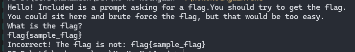
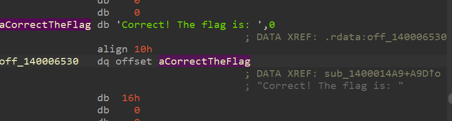
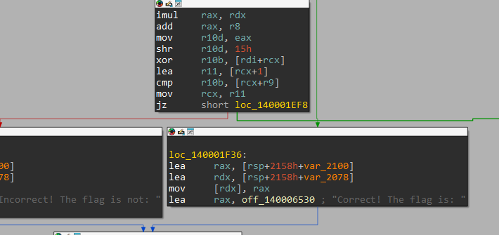
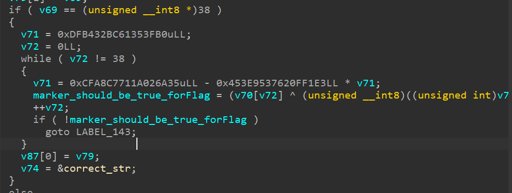
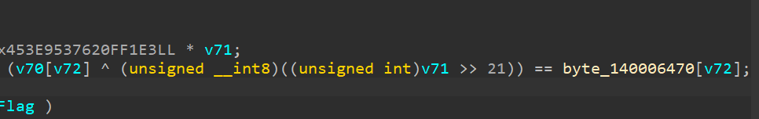
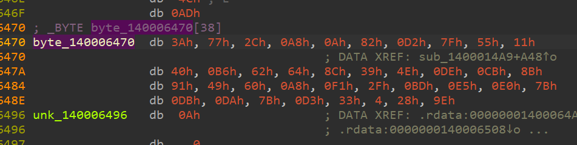
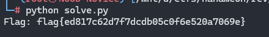
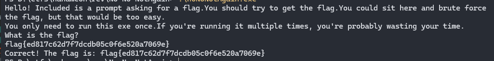

# No No NotAgain Challenge Writeup

**Category:** Reverse Engineering  
**CTF Name:** Nahamcon CTF 2025  

---

## 🔍 Challenge Description  

> TAuthor: Nordgaren

> Yeah, so... It's a crackme... It's in your FAVORITE language to Reverse Engineer!

> Rust!


---

## 📂 Files Provided  

- `noNoNotAgain.exe`

---

## 🛠️ Tools Used  

- IDA - For Static Analysis

---

## 📝 Approach

```
I wasted alot of time, understanding the odd behaviour of binary while debugging it, without going to xrefs.
and assuming the check maybe wayy above the xref.
You can see i was reading asm and decompilation of binary, and kept it in Asm and Decomp file, So i could give it to AI to figure it out for me xD

```

1. When we start the challenge it asks for a flag




2. So as the previous [Whats a base](../What's%20a%20base%20amoungst%20friends/) was approached



3. Target function







We can see to get the flag the if() should be true to this byte array





So we have the value of byte array




## 📝 Script

```


# Constants from the assembly
initial_v71 = 0xDFB432BC61353FB0
C = 0xCFA8C7711A026A35
D = 0x453E9537620FF1E3

# Target bytes as given (first 38 bytes)
target_bytes = [
    0x3A, 0x77, 0x2C, 0xA8, 0x0A, 0x82, 0xD2, 0x7F, 0x55, 0x11,
    0x40, 0xB6, 0x62, 0x64, 0x8C, 0x39, 0x4E, 0xDE, 0xCB, 0x8B,
    0x91, 0x49, 0x60, 0xA8, 0xF1, 0x2F, 0xBD, 0xE5, 0xE0, 0x7B,
    0xDB, 0xDA, 0x7B, 0xD3, 0x33, 0x04, 0x28, 0x9E
]

v71 = initial_v71
flag_bytes = []

# Iterate 38 times
for i in range(38):
    # Update v71 with 64-bit overflow
    v71 = (C - D * v71) & ((1 << 64) - 1)
    # Compute key: bits 21-28 (shift right 21, mask 8 bits)
    key = (v71 >> 21) & 0xFF
    # Derive input byte
    input_byte = target_bytes[i] ^ key
    flag_bytes.append(input_byte)

# Convert to ASCII
flag = bytes(flag_bytes).decode('ascii', errors='replace')
print("Flag:", flag)


```




---

We entered the correct flag !




---

## 🏁 Flag  

`flag{ed817c62d7f7dcdb05c0f6e520a7069e}`

---

## 📌 Notes

- 
