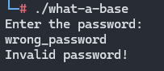

# What's a base Amoungst friends Challenge Writeup

**Category:** Reverse Engineering  
**CTF Name:** NahamCon CTF 2025  


---

## 🔍 Challenge Description  

> Author: @Kkevsterrr

> What's a base amongst friends though, really?

---

## 📂 Files Provided  

- `what-a-base`

---

## 🛠️ Tools Used  

- IDA - For Static Analysis

---

## 📝 Approach  
1. When we run the binary it asks for a password.



2. Soo first i thought it would be solved by some constraints solver / symbolic excution, But when you analyze the source code its never ending code and yea there arnt any constrants (As per my knowledge)

3. So we search "Invalid" string xrefs


4. we need to jump to the Congrats xrefs


I renamed it for my convention, now decompile

the congrats string was printing inside an if() block.


5. This caught my eyes, 
```
  sub_8B40(&v33, &v6[v26], v20);
  v22 = s1;
  if ( v35 == 88 && !bcmp(s1, aM7xzr7muqtxsr3, 0x58uLL) )

but the major confusion which i got into that there is no connection of any value passed
in a sub_8B40() which is influencing the if condition. it turns out it is done my the compiler it self, many members of structs when decompiled become different variables placed on stack frame, but they are contigous in stack frame!
```
As you can see here


So one part of the key maybe (i am guessing) is 


It is a global variable 


But it alone doesnt give the flag so we analyzed sub_8B40() because the first parameter is being passed as a reference.
I can see another global variable in that function


So now we already have the formula to calulate flag in the if() so we just write a simple script


## 📝Script
```

import math

# Cipher text from the challenge (z-base-32 encoded)
cipher = "m7xzr7muqtxsr3m8pfzf6h5ep738ez5ncftss7d1cftskz49qj4zg7n9cizgez5upbzzr7n9cjosg45wqjosg3mu"

# z-base-32 alphabet
alphabet = "ybndrfg8ejkmcpqxot1uwisza345h769"
rev = {c: i for i, c in enumerate(alphabet)}

# Convert each character to its 5-bit representation
bits = "".join(format(rev[ch], '05b') for ch in cipher)

# Group into bytes (8 bits)
decoded = bytearray(int(bits[i:i+8], 2) for i in range(0, len(bits) // 8 * 8, 8))

# Display the decoded plaintext
password  = decoded.decode()
print(password)


```


---

## 🏁 Flag  

` flag{50768fcb270edc499750ea64dc45ee92}`

---

## 📌 Notes  

- I wasted alot time in IDA, trying to analyze every espect of binary which is just O_o , I was given a very very good hint so i was able to solve the challenge.


